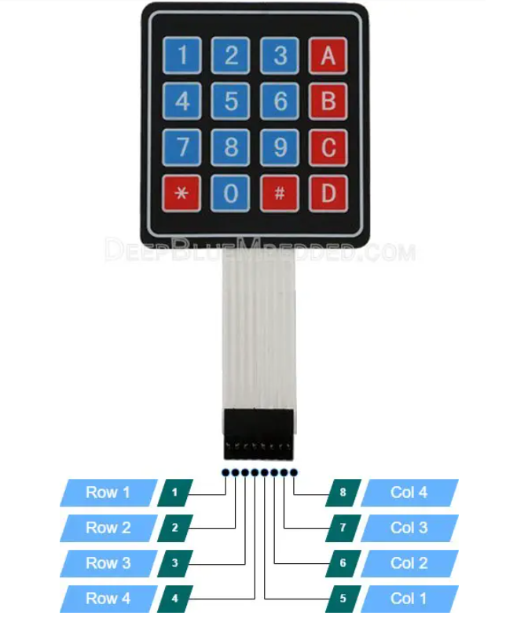
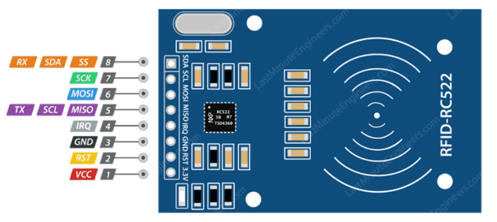
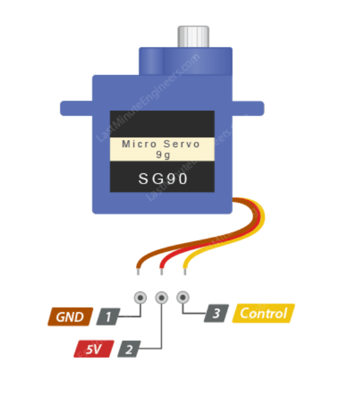
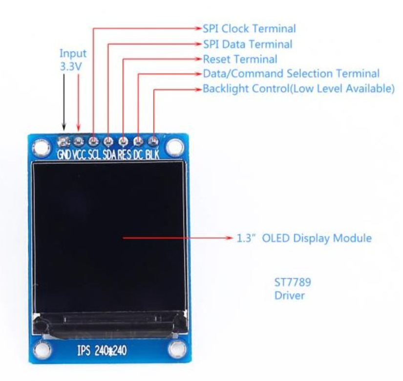
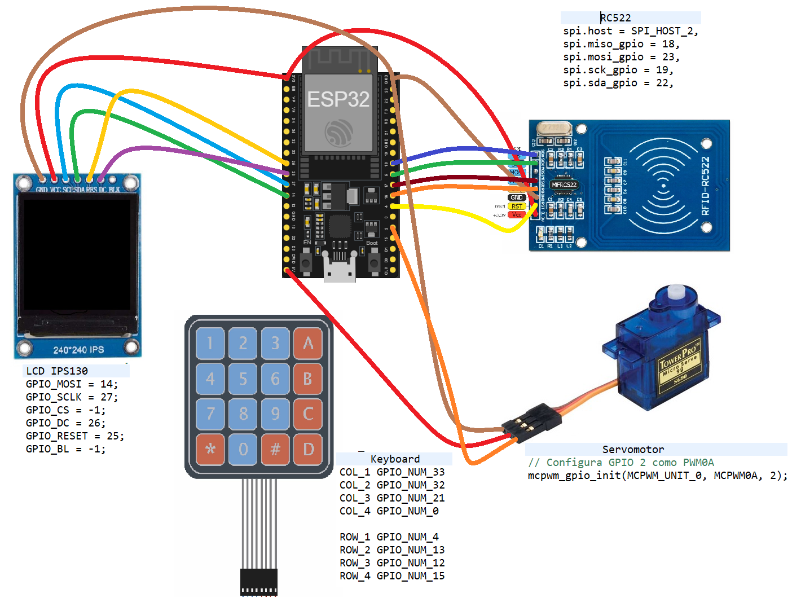
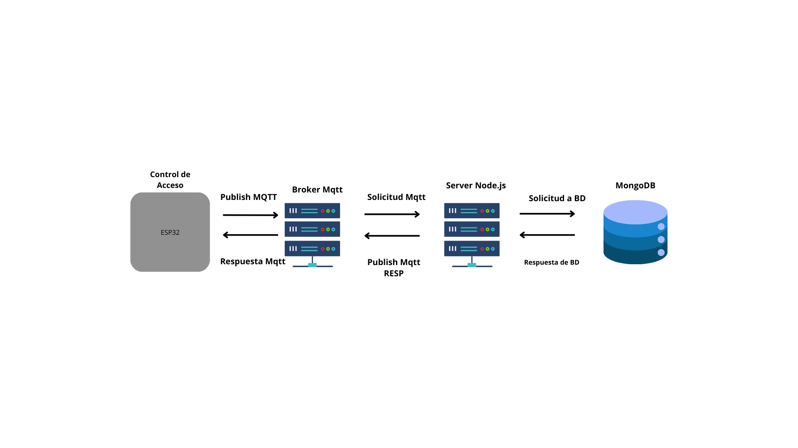

# Sistema de Control de Acceso con ESP32

Este proyecto implementa un sistema de control de acceso basado en el ESP32, permitiendo la autenticación mediante un teclado matricial y un lector de tarjetas RC522. El sistema se comunica a través de MQTT y controla un servomotor para abrir y cerrar un cofre de seguridad o puerta.

## Tabla de Contenidos

- [Descripción](#descripción)
- [Características](#características)
- [Hardware Necesario](#hardware-necesario)
- [Configuración del Proyecto](#configuración-del-proyecto)
  - [Clonar el Repositorio](#1-clonar-el-repositorio)
  - [Configurar el Entorno de Desarrollo](#2-configurar-el-entorno-de-desarrollo)
  - [Configurar MQTT](#3-configurar-mqtt)
  - [Configurar Pines](#4-configurar-pines)
  - [Compilar y Flashear](#5-compilar-y-flashear)
- [Uso del Sistema](#uso-del-sistema)
  - [Inicio del Sistema](#1-inicio-del-sistema)
  - [Ingreso de Código](#2-ingreso-de-código)
  - [Uso de Tarjeta RFID](#3-uso-de-tarjeta-rfid)
  - [Apertura y Cierre del Cofre/Puerta](#4-apertura-y-cierre-del-cofrepuerta)
 - [Documentación](#Documentación-generada-por-Doxygen)
- [Notas Técnicas](#notas-técnicas)
- [Licencia](#licencia)

## Descripción

Este proyecto está diseñado para gestionar el acceso a un cofre de seguridad o puerta mediante un teclado matricial y un lector de tarjetas RC522. El cofre puede ser utilizado para depositar llaves u otros objetos de valor. El sistema permite abrir el cofre mediante la introducción de un código numérico o la presentación de una tarjeta RFID autorizada.

## Características

- **Control de Acceso**: Utiliza un teclado matricial para la entrada de códigos y un lector RC522 para la autenticación con tarjetas RFID.
- **MQTT**: Comunicación con un servidor MQTT para gestionar comandos y respuestas.
- **Servo**: Controla la apertura y cierre del cofre/puerta mediante un servomotor.
- **Pantalla LCD**: Muestra mensajes e información del estado.
- **Modo Seguro**: Cierra automáticamente el cofre después de 15 segundos de apertura.
- **Base de datos**: Se usa MongoDB para el almacenamiento de los usuarios del acceso (Información de configuración en repositorio de backend).
- **Servidor Backend**: Para la gestion de las comunicaciones con el broKer Mqtt y la Base de datos.
[Repositorio Backend](https://github.com/SantiagoAlthabe/web-control-acceso)
- **Frontend**: Interfaz de usuario para la gestion de permisos de accesos a tarjetas y codigos.(Información de configuración en repositorio de backend).

## Hardware Necesario

- **ESP32**: Microcontrolador central del sistema.

- **Teclado Matricial (4x4)**: Para la entrada de códigos.

- **Lector de Tarjetas RC522**: Para la autenticación RFID.

- **Servomotor**: Controla la apertura y cierre del cofre.

- **Pantalla LCD (ST7789)**: Muestra mensajes y estado.

- **Esquema de conexión**: A modo ilustrativo se muestra este esquema. La posición de los pines puede variar segun el fabricante del pcb.


## Esquema de comunicacion
- Comunicación entre ESP32, Mqtt, Node.js y MongoDB



## Configuración del Proyecto

### 1. Clonar el Repositorio

```bash
git clone https://github.com/SantiagoAlthabe/Control-de-acceso.git
cd Control-de-acceso
```

### 2. Configurar el Entorno de Desarrollo
Sigue la guía oficial de ESP-IDF para configurar el entorno de desarrollo.

### 3. Configurar WIFI y MQTT 
Edita sdkconfig para configurar tu red WIFI y la URL de tu broker MQTT:
```bash
CONFIG_EXAMPLE_WIFI_SSID="YOURWIFINAME"
CONFIG_EXAMPLE_WIFI_PASSWORD="YOURWIFIPASSWORD"
CONFIG_BROKER_URL="mqtt://broker.url"
```
### 4. Configurar Pines
Ajusta los pines en tu código según tu hardware:

Teclado Matricial: GPIO 0, 4, 12, 13, 15, 21, 32, 33
Servo: GPIO 2
RC522: GPIO 18 (MISO), 19 (SCK), 22 (SDA), 23 (MOSI)
LCD: GPIO 14 (MOSI), 25(RST), 26(DC), 27 (SCK).

### 5. Compilar y Flashear
Compila
```bash
idf.py build
```
Flash
```bash
idf.py -p [puerto_serial] flash
```
## Uso del Sistema

### 1. Inicio del Sistema
Enciende el ESP32. Este debería conectarse a la red Wi-Fi configurada y al servidor MQTT. La pantalla LCD mostrará un mensaje de inicio.

### 2. Ingreso de Código
Usa el teclado para ingresar un código numérico de 6 dígitos.
Presiona # para enviar el código.
Presiona * para cancelar y reiniciar el ingreso del código.
### 3. Uso de Tarjeta RFID
Presenta una tarjeta al lector RC522.
El sistema autentica la tarjeta y responde con un mensaje en la LCD.
### 4. Apertura y Cierre del Cofre/Puerta
El backend devuelve las siguientes respuestas:
Código 111: Se usa para activar una salida de relé (no definida en el codigo).
Código 101: Abre el cofre a 60 grados y, después de 15 segundos, lo cierra moviendo el servo de vuelta a 0 grados.
Código 100: Acceso denegado.
### Documentación generada por Doxygen
- [Doxygen](https://magnificent-raindrop-5e9a9c.netlify.app/files.html)
### Notas Técnicas
Tiempo de Espera del Código: Si el código no se completa en 15 segundos, se limpia el buffer.
- Servo: El servo se mueve a 0 grados para abrir y a 60 grados para cerrar.
- Mensajes MQTT: El sistema publica  mensajes en los temas **/cntrlaxs/solicitud**, **/cntrlaxs/solicitud/card**, **/cntrlaxs/solicitud/code** y suscribe **/cntrlaxs/respuesta/{id_de_dispositivo}**.
- En este tópico se publica el mensaje con el id del dipositivo una vez que se conecta **/cntrlaxs/solicitud/**
- En este tópico se publica el mensaje con el codigo ingresado por teclado **/cntrlaxs/solicitud/code**
- En este tópico se publica el mensaje con el codigo leido por el lector de tarjetas RC522 **/cntrlaxs/solicitud/code**
- Este tópico se crea en el backend con el ID del dispositivo, con el objetivo de responder a un único dispositivo **/cntrlaxs/respuesta/{id_de_dispositivo}**.

## Repositorios y librerias usados:
 - [RC522 card reader](https://github.com/abobija/esp-idf-rc522) 
 - [LCD IPS130](https://github.com/nopnop2002/esp-idf-st7789/)
 - [Teclado 4x4](https://github.com/microdevg/keyboard)


## Este proyecto está licenciado bajo la MIT License.

Autor: Santiago Althabe


